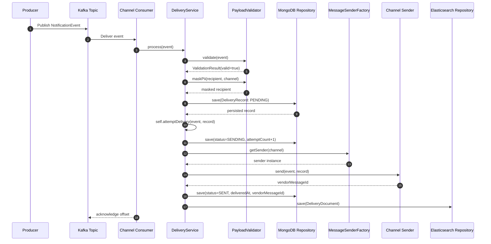
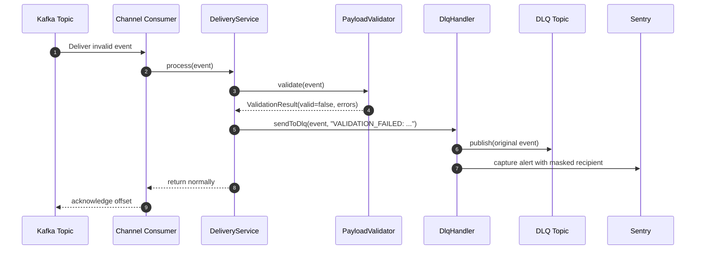
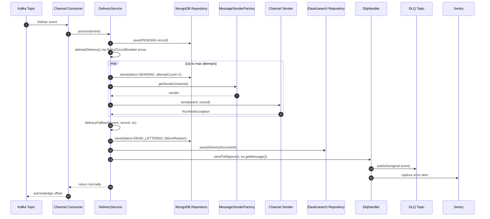
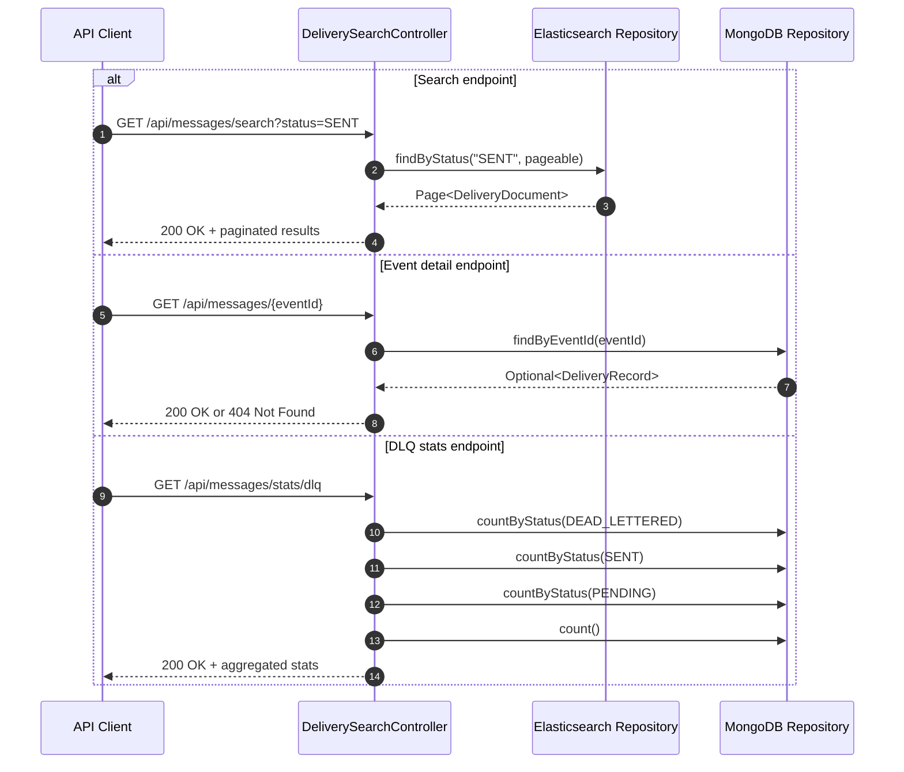
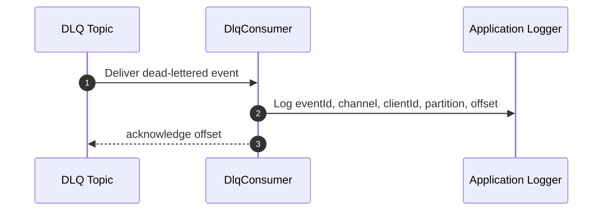

# message-relay - Low Level Design (LLD)

Derived from architecture baseline in HLD-LLD.md.

## 2. Low Level Design (LLDs)

## 2.1 LLD-1: Event Ingestion and Consumer Layer

### Objective
Consume channel-specific Kafka messages and delegate to the core delivery workflow.

### Classes and Responsibilities
- `EmailConsumer`, `SmsConsumer`, `WhatsAppConsumer`, `PaymentConsumer`
  - Each has `@KafkaListener` bound to one topic property.
  - Delegates event to `DeliveryService.process(event)`.
  - Uses manual acknowledgment mode and acknowledges after handling.
- `KafkaConsumerConfig`
  - Builds consumer factory for `NotificationEvent`.
  - Sets group id, offset reset, disabled auto-commit.
  - Configures listener container factory with manual ack and concurrency.

### Behavior Notes
- Main consumer group: `delivery-engine-group`.
- `NotificationEventDeserializer` handles JSON conversion including `LocalDateTime`.

### Sequence (Text)
1. Kafka delivers event to listener.
2. Listener invokes service processing.
3. Listener acknowledges record after processing returns.

## 2.2 LLD-2: Validation and Orchestration (DeliveryService)

### Objective
Perform business workflow from validation to final status update.

### Main Method Flow
`process(NotificationEvent event)`:
1. Validate payload (`PayloadValidator.validate`).
2. If invalid: increment validation metric and send directly to DLQ.
3. Build and persist initial `DeliveryRecord` (`PENDING`).
4. Invoke `attemptDelivery` through self-proxy to ensure AOP interception.
5. Catch unexpected exceptions and force DLQ as safety net.

`attemptDelivery(NotificationEvent event, DeliveryRecord record)`:
1. `@Retry` and `@CircuitBreaker` protected operation.
2. Transition status to `SENDING`, increment attempt count, persist.
3. Resolve sender by channel through factory.
4. Send and capture vendor id.
5. Transition to `SENT`, persist, index in Elasticsearch, increment success metric.

`deliveryFallback(...)`:
1. Called after retry/circuit-breaker exhaustion.
2. Set failure reason and transition to `DEAD_LETTERED`.
3. Persist + index search doc.
4. Increment failure metric.
5. Publish event to DLQ.

### Important Design Decisions
- Self-injection (`@Lazy DeliveryService self`) to preserve AOP behavior.
- Search indexing is best-effort (exception swallowed with warning).

### Sequence Diagrams

#### 2.2.1 Consumer Ingestion and Successful Delivery

#### 2.2.2 Validation Failure to DLQ

#### 2.2.3 Retry Exhaustion and Dead-Letter Flow

#### 2.2.4 Search API Flow

#### 2.2.5 DLQ Monitoring Flow

## 2.3 LLD-3: Sender Strategy and Channel Abstraction

### Objective
Allow channel-specific sending logic without changing orchestration flow.

### Structure
- `MessageSender` interface:
  - `String send(NotificationEvent, DeliveryRecord)`
  - `NotificationEvent.Channel supportedChannel()`
- `MessageSenderFactory`:
  - Constructor receives all `MessageSender` beans.
  - Builds map keyed by `supportedChannel()`.
  - Provides `getSender(channel)` with error on unsupported channel.
- Implementations:
  - `EmailSender`
  - `SmsSender`
  - `WhatsAppSender`

### Extensibility Path
To add a new channel, add enum value + new sender bean implementing `MessageSender`; no orchestration rewrite needed.

## 2.4 LLD-4: Data Model and Persistence

### Objective
Persist authoritative history and provide search-optimized projection.

### MongoDB Entity: `DeliveryRecord`
Fields:
- Identity and routing: `id`, `eventId`, `clientId`, `channel`, `correlationId`
- Recipient data: `recipient` (masked), `recipientRaw`
- Template data: `templateId`, `templateParams`
- Delivery tracking: `status`, `attemptCount`, `failureReason`, `vendorMessageId`, `createdAt`, `deliveredAt`
- Audit trail: `statusHistory` with `StatusTransition {from,to,reason,at}`

Indexed fields include `eventId`, `clientId`, `recipient`, `status`, `createdAt`.

### Elasticsearch Entity: `DeliveryDocument`
Denormalized search record containing event metadata and status fields for query endpoints.

### Repository Layer
- `DeliveryRecordRepository` (Mongo)
  - Query methods for event id, status filters, recipient, aggregation counters.
- `DeliverySearchRepository` (Elasticsearch)
  - Query methods for client/status/channel/recipient-based paging.

## 2.5 LLD-5: Failure Handling, DLQ, and Monitoring

### Objective
Prevent message loss and surface operational failures.

### Components
- `DlqHandler`
  - Publishes failed events to configured DLQ topic using `KafkaTemplate`.
  - Adds completion callback logging partition and offset.
  - Emits Sentry alert with event tags and masked recipient.
- `DlqConsumer`
  - Separate listener on DLQ topic for monitoring/auditing.
  - Concurrency set to 1.

### Failure Categories
- Validation failure -> immediate DLQ.
- Runtime/transient sender failure -> retries then fallback to DLQ.
- Unexpected processing exceptions -> catch-all path to DLQ.

## 2.6 LLD-6: API Layer

### Controller: `DeliverySearchController`
Endpoints:
- `GET /api/messages/search`
  - Filter combinations by `clientId`, `status`, `channel`, `recipient`.
  - Uses Elasticsearch repository with pageable sort by `createdAt desc`.
- `GET /api/messages/{eventId}`
  - Reads full delivery record and status history from MongoDB.
- `GET /api/messages/stats/dlq`
  - Returns totals, sent, dead-lettered, pending, and success percentage.

### API Design Notes
- Search endpoint prioritizes certain filter combinations (`clientId+status`, `channel+status`) before simpler filters.
- Detailed authoritative record is served from MongoDB.

## 2.7 LLD-7: Health and Observability

### Health
`DependencyHealthIndicator` checks:
- MongoDB ping via `MongoTemplate.executeCommand`.
- Kafka cluster id via AdminClient timeout-bounded call.
- Elasticsearch HTTP probe.

Status policy:
- Mongo/Kafka down -> `DOWN`
- Mongo+Kafka up but Elasticsearch down -> `DEGRADED`
- All up -> `UP`

### Metrics
- `delivery.success`
- `delivery.failure`
- `delivery.validation.failed`
- `delivery.retry.attempt`
- `delivery.circuit.open` gauge

### Logging and Alerting
- App logs at INFO; framework noise reduced to WARN.
- Sentry receives DLQ alert events with metadata and reason.

---

